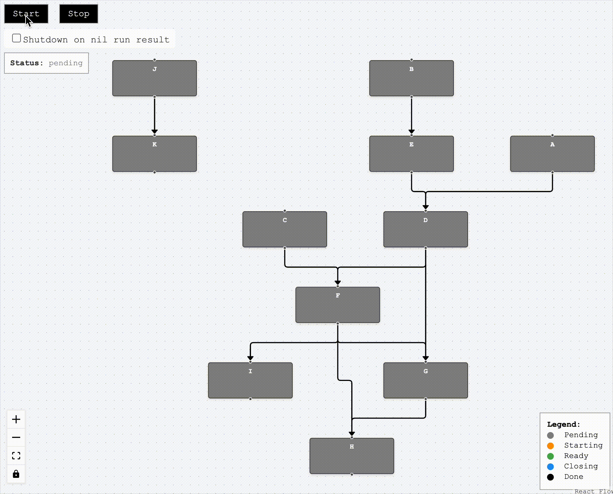
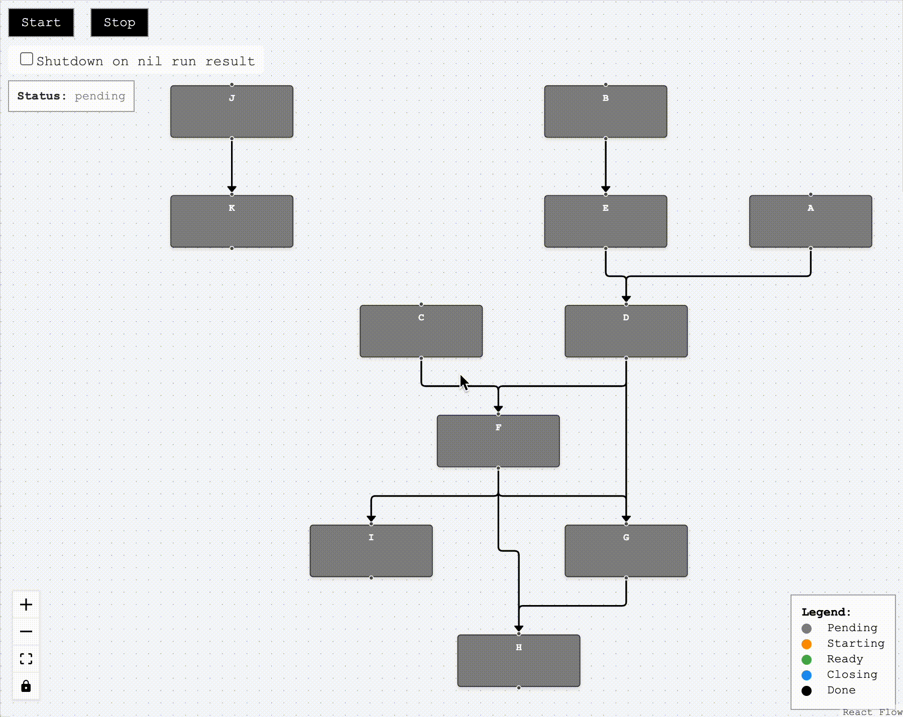
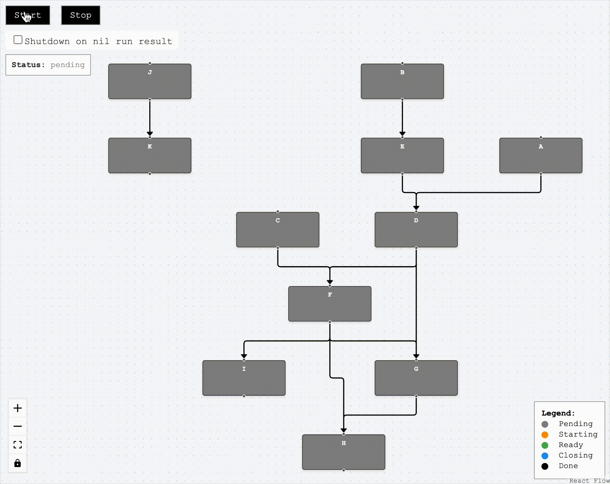

[](https://github.com/cardinalby/depo/actions/workflows/list.yml)
[](https://github.com/cardinalby/depo/actions/workflows/test.yml)
[](https://pkg.go.dev/github.com/cardinalby/depo)

"depo" is a complete solution for managing **dependency construction** and **lifecycles** in Golang projects.

> [!NOTE]
> Automated DI frameworks ([Uber Fx](https://github.com/uber-go/fx), [Wire](https://github.com/google/wire))
> don't play well with the absence of annotations and "local interfaces" idea in Go. 
> 
> Many of Go developers also prefer to have more control and pass dependencies explicitly. 
> 
> But the problem of managing dependencies initialization and run order in larger projects is 
> still there and that's what the library is designed to address.

## 🔹 Alternative to automated Dependency Injection

With the library you still manually choose the dependencies to initialize your components but also benefit
from traditional DI features like:
- Building a **dependency graph** to use for running/shutting down components in the right order
- **Lazy initialization** of components (avoid creating components that are never used)
- Resolving **circular dependencies** (that's what both Uber Fx and Wire failed to do but is handled in other languages)
  by using **late initialization**

## 🔹 Concurrent run and shutdown

➡️ [Web Demo page](https://cardinalby.github.io/depo/)

<details>
<summary>Full application lifecycle</summary>
    
</details>

<details>
<summary>A component fails to Start</summary>
    
</details>

<details>
<summary>Component's Run method returns an error</summary>
    
</details>

Since the library builds the dependency graph, manage the entire application lifecycle with `Runner` that can start and 
shut down components in the proper order **concurrently** when possible, speeding up your starts and shutdowns.
`SIGINT/SIGTERM` [shutdown context](/pkg/contexts/shutdown_context.go) is supported out of the box.

> **Fx**'s [lifecycle](https://uber-go.github.io/fx/lifecycle.html) starts components sequentially in the order they have 
> been registered in it, while **depo** uses the dependency graph which enables it to start and shut down the components 
> that are not dependent on each other concurrently

The library [supports](docs/3_lifecycle.md) both **waiting** (`Run`) and **async** (`Start` and/or `Close`) 
lifecycle semantics for components

## 🔹 Getting started

```shell
go get github.com/cardinalby/depo
```

Check out the [documentation](/docs/1_basics.md)