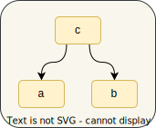

# Basics

## Providers

The core concept is **"Provider"** - a lazy wrapper of a component constructor. Basically, it **defines** the 
way the component can be constructed and what dependencies it requires.

**Component** is any entity of your application: service, repository, cache, use-case, connection provider, etc.

We use [`depo.Provide`](https://pkg.go.dev/github.com/cardinalby/depo#Provide) to wrap a `provide` function that 
returns a component ([EX1](./assets/basics/ex1_provide/ex_test.go)):

```go
import "github.com/cardinalby/depo"

// `a` is `func() *ComponentA`
a := depo.Provide(func() *ComponentA {
    return NewComponentA("AA") // has no dependencies
})

b := depo.Provide(func() *ComponentB {
    return NewComponentB("BB") // has no dependencies
})

c := depo.Provide(func() *ComponentC {
    return NewComponentC(
        "CC", // `c` depends on:
        a(),  // - `a`
        b(),  // - `b`
    )
})

// CC AA BB
fmt.Println(
    c().Name,  // initializes a, b, c
    a().Name,  // returns memoized a
    b().Name,  // returns memoized b
)
```

Resulting `a`, `b`, and `c` functions are **providers** that 
- are **lazy** (`provide` callback is called once when the provider is accessed the first time and the result is **memoized**)
- **track access** to other providers (dependencies) and build a **dependency graph** of the components:

<p align="center">
    
</p>

## Dependency tracking

Internal tracking of dependencies is needed to build a **dependency graph** for proper start/shutdown order
of components managed by `Runner`.

👉 [Components' lifecycle](./3_lifecycle.md)

The **tracking** is based on the **call stack** inspection which brings us to the main **limitation** of the library:

> [!CAUTION]
> You **should not** call other **providers** in another goroutine inside `provide` function.
> 
> - Since only one `provide` function can be executed at a time, it can cause a deadlock
> - Access to a provider in another goroutine will not be tracked as a dependency

### Valid case ([EX3](./assets/basics/ex3_goroutine_valid/ex_test.go)): 

You still can call providers in goroutines outside of `provide` functions:

```go
a := depo.Provide(...)
b := depo.Provide(...)

var wg sync.WaitGroup
wg.Add(2)

go func() {
    a() // waits until providing is done in second goroutine 
        // (if it started first)
    wg.Done()
}()

go func() {
    b() // waits until providing is done in first goroutine 
        // (if it started first)
    wg.Done()
}()

wg.Wait()
```

### ⚠️ Deadlock example ([EX4](./assets/basics/ex4_goroutines_deadlock/ex_test.go)):

```go
a := depo.Provide(...)

b := depo.Provide(func() *ComponentB {
    done := make(chan struct{})
    go func() {
        a() // a() is waiting for b() to finish providing 
            // to start a new providing session
        close(done)
    }()
    <-done // b() is waiting for goroutine to finish

    return NewComponentB("BB")
})

b()
```

## Error handling

As you could notice, [`Provide`](https://pkg.go.dev/github.com/cardinalby/depo#Provide) doesn't support **errors** 
in its signature.
It may be ok to **panic** in the application initialization code if we can't create a component, to avoid verbose 
error handling and fail early.

If you want to handle errors manually you can use [`depo.ProvideE`](https://pkg.go.dev/github.com/cardinalby/depo#ProvideE) 
version ([EX2](./assets/basics/ex2_provide_e/ex_test.go)):

```go
// `a` is a component that can fail to create
a := depo.ProvideE(func() (*ComponentA, error) {
    return nil, errors.New("error creating A")
})

b := depo.Provide(func() *ComponentB {
    return NewComponentB("BB")
})

// `c` can't do without `a`
c := depo.ProvideE(func() (*ComponentC, error) {
    compA, err := a()
    if err != nil {
        return nil, fmt.Errorf("error getting component A: %w", err)
    }
    return NewComponentC(
        "CC",
        compA,
        b(),
    ), nil
})

// but `d` can ignore `a` error and do without it
d := depo.Provide(func() *ComponentD {
    compA, err := a()
    if err != nil {
        log.Printf("`d` will do without `a`: %v", err)
    }
    return NewComponentD(
        "DD",
        compA,
        b(),
    )
})

fmt.Println(a()) // <nil> error creating A
fmt.Println(c()) // <nil> error getting component A: error creating A
fmt.Println(d()) // &{DD <nil> <b_ptr>} <--- created without A
```

Here we end up with the following graph:

<p align="center">
    
</p>

- `a` construction can **fail** (and it does). It's declared using `ProvideE` to emphasize that
- `c` depends on `a` and it **can't do without it** so it returns an **error** once it receives 
an error from `a`
- `d` considers `a` as an **optional dependency** and ignores its error and **gets created without it**. But since
`a` returned an error, `a` **isn't included** in `d`'s dependencies in the graph

It's an example of how you can combine [`Provide`](https://pkg.go.dev/github.com/cardinalby/depo#Provide) and 
[`ProvideE`](https://pkg.go.dev/github.com/cardinalby/depo#ProvideE) functions in the component definitions.

### Cyclic dependencies

When you have **circular dependencies** between your components, 
[`ErrCyclicDependency`](https://pkg.go.dev/github.com/cardinalby/depo#ErrCyclicDependency) occurs at the call
of a provider that is being constructed (from a `provide` function of one of its dependencies).

- In case of `Provide`, the error is thrown in **panic**
- In case of `ProvideE`, the **error is returned** and can be ignored as in the example above

The component that caused the error will be considered failed and won't be included in the graph.

👉 [Resolving cyclic dependencies](2_resolving_cycles.md)

### Debug info

There are some utilities to help you debug the dependency graph and `Runner` behavior:

👉 [Debug info](5_debug_info.md)
