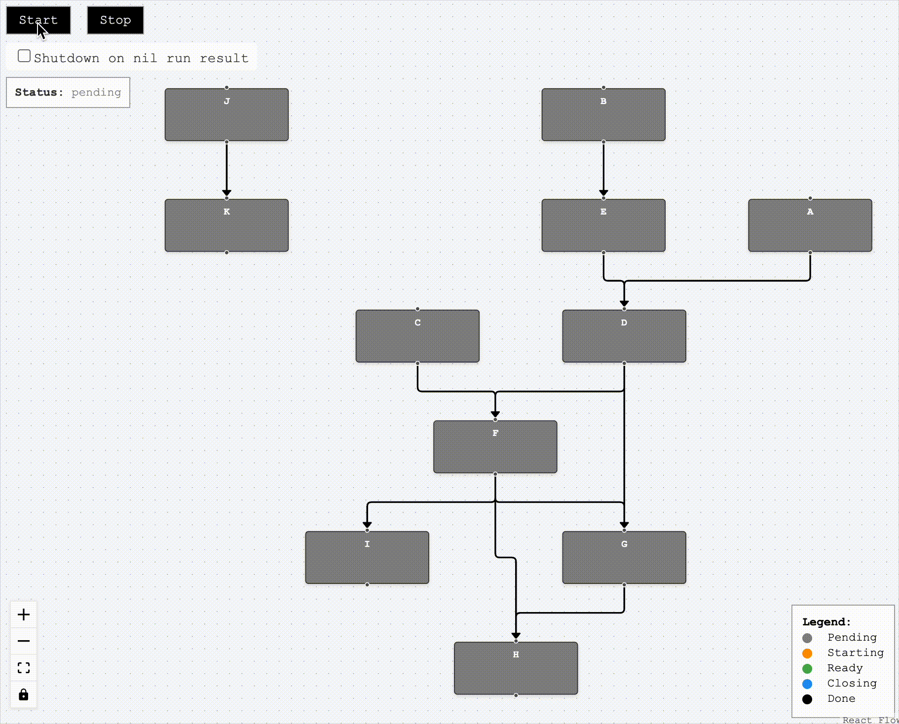

# Application Runner

The `Runner` is responsible for managing the entire application [lifecycle](3_lifecycle.md), starting and shutting down
the components in the proper order based on their [dependencies](1_basics.md).

> It's similar to **Fx**'s [lifecycle](https://uber-go.github.io/fx/lifecycle.html) which starts components 
> sequentially in the order they have been registered in it, while **Runner** uses the dependency graph which 
> enables it to start and shut down the components that are not dependent on each other concurrently

Imagine the following simple application:

<p align="center">
    
</p>

The **purpose** of the application is to **receive HTTP** requests and **process messages** from a message **queue**.

You have defined all the components with their dependencies and lifecycle hooks. Now you want the application
to fulfill its purpose.

🤔 That's the way **depo** encourages you to think: just requre _"HTTP Srv"_ and _"Msg Queue Consumer"_ to be running
and make **depo** take care of constructing dependencies and managing their lifecycles for you.

You need to create a `Runner` in a way similar to other components by requesting these **root** components:

```go

import(
    "log"
    "github.com/cardinalby/depo"
    "github.com/cardinalby/depo/pkg/contexts"
)

func main() {
    // ... other components
    httpSrv := depo.Provide(...)
    msgQueueConsumer := depo.Provide(...)
		
    // Create a new Runner instance
    runner := depo.NewRunner(func () {
        // Request root components
        httpSrv()
        msgQueueConsumer()
    })
	
    // The lib provides SIGINT/SIGTERM shutdown context out of the box
    ctx := contexts.NewShutdownContext(contexts.Background())
    onReady := func() {
        log.Println("Application started (readiness probe passed)")	
    }
	
    err := runner.Run(ctx, onReady)
    log.Println("Application is done:", err)
}
```

## Cyclic dependencies again

`NewRunner` can panic with `ErrCyclicDependency` error if:
- there are cyclic dependencies between components that haven't been 
  [resolved with late initialization](2_resolving_cycles.md)
- there are cyclic dependencies between lifecycle-aware components that can't be resolved with late initialization

> [!NOTE]
> There is a `NewRunnerE` variant that returns the error instead of panicking

## Runner lifecycle

**Runner** itself behaves as an aggregated [ReadinessRunnable](./3_lifecycle.md) that:
- **Starts** all components that have `Starter`, `Runnable` or `ReadinessRunnable` lifecycle hooks
  in the proper order (from leaves to roots)
- Once they are all **started** successfully, it calls the `onReady` **callback**
- If any of the components **fail** to start, it **shuts down** all components that have already been started 
- **Waits** for the `ctx` to be done (e.g. on `SIGINT`/`SIGTERM`) or for any of the components to return an **error** from 
  their `Run` method
- **Shuts down** all components that have `Closer`, `Runnable` or `ReadinessRunnable` lifecycle hooks in the proper 
  order (from roots to leaves)
- Returns the **error** that caused the **shutdown** (can be `nil` if all components finished with no error)

Check out the **demo web page** (based on WebAssembly-compiled example application) to see how it works

➡️ [Web Demo page](https://cardinalby.github.io/depo/)

On the page you can click on any component to assign it a start error or make it return `Run` error.

<details>
<summary>🔹 Full application lifecycle</summary>
    
</details>

<details>
<summary>🔹 A component fails to Start</summary>
    
</details>

<details>
<summary>🔹 Component's Run method returns an error</summary>
    
</details>

## Runner options

`NewRunner` and `NewRunnerE` accept optional arguments that can be used to configure a Runner

### 🔹 OptStartTimeout(...)

`OptStartTimeout(timeout time.Duration)` instructs the Runner to apply the start timeout to all components that have
`Starter` or `ReadinessRunnable` lifecycle hooks (if they haven't specified this option by themselves).

- A context with the timeout will be passed to `Start` methods
- Context passed to `Run` methods will be cancelled with `context.DeadlineExceeded` cause error if `ReadinessRunner`
  hasn't called `onReady` callback before the timeout

### 🔹 OptNilRunResultAsError()

By default, `nil` error returned by `Runnable` or `ReadinessRunnable` components is treated as a successful 
completion and doesn't trigger shutdown of other components.

This options changes this behavior for all such components. After receiving `nil` error from `Run` method, the Runner
will trigger shutdown with `ErrUnexpectedRunNilRunResult` cause.

### 🔹 OptRunnerListeners(...)

If you want to observe lifecycle phases of individual components (e.g. for logging or metrics purposes), you can 
specify one or more [`RunnerListener`](https://pkg.go.dev/github.com/cardinalby/depo#RunnerListener) instances 
with this option

## Debug info

There are some utilities to help you debug the dependency graph and `Runner` behavior:

➡️ [Debug info](5_debug_info.md)